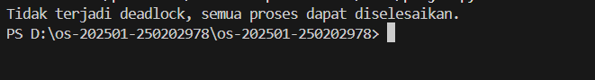

# Laporan Praktikum Minggu 14
Topik: Penyusunan Laporan Praktikum Format IMRAD

Deadlock Detection pada Sistem Operasi

Praktikum ini membahas penerapan algoritma deadlock detection pada sistem operasi untuk mengidentifikasi proses-proses yang terlibat dalam kondisi deadlock berdasarkan data alokasi dan permintaan sumber daya. Pengujian dilakukan dengan mensimulasikan kondisi sistem menggunakan matriks sumber daya dan mengevaluasi apakah seluruh proses dapat dieksekusi hingga selesai atau tidak.

---

## Identitas
- **Nama**  : Faris Azhar
- **NIM**   : 250202978
- **Kelas** : 1 IKRA

---

## Tujuan
Setelah menyelesaikan tugas ini, mahasiswa mampu:
1. Menyusun laporan praktikum dengan struktur ilmiah (Pendahuluan–Metode–Hasil–Pembahasan–Kesimpulan).
2. Menyajikan hasil uji dalam bentuk tabel dan/atau grafik yang jelas.
3. Menuliskan analisis hasil dengan argumentasi yang logis.
4. Menyusun sitasi dan daftar pustaka dengan format yang konsisten.
5. Mengunggah draft laporan ke repositori dengan rapi dan tepat waktu.

---

## Dasar Teori
Deadlock adalah kondisi pada sistem operasi ketika dua atau lebih proses saling menunggu sumber daya yang sedang digunakan oleh proses lain, sehingga tidak ada proses yang dapat melanjutkan eksekusi. Deadlock dapat terjadi apabila empat kondisi terpenuhi secara bersamaan, yaitu mutual exclusion, hold and wait, no preemption, dan circular wait.

Salah satu cara penanganan deadlock adalah deadlock detection, yaitu dengan membiarkan deadlock terjadi, kemudian mendeteksinya menggunakan algoritma tertentu. Algoritma deadlock detection memanfaatkan available vector, allocation matrix, dan request matrix untuk menentukan apakah suatu proses dapat dieksekusi dengan sumber daya yang tersedia.

Proses yang permintaannya dapat dipenuhi akan dieksekusi dan sumber dayanya dilepaskan kembali. Jika terdapat proses yang tidak pernah dapat dieksekusi, maka proses tersebut dinyatakan berada dalam kondisi deadlock. Pendekatan ini penting untuk membantu sistem operasi mengidentifikasi masalah pengelolaan sumber daya dan menjaga stabilitas sistem.
---

## Langkah Praktikum
1. **Menentukan Topik Laporan**

   Pilih 1 topik dari praktikum sebelumnya (mis. Minggu 9/10/11/13) dan tetapkan tujuan eksperimen yang ingin disampaikan.

2. **Menyiapkan Bahan**

   - Kode/program yang digunakan.
   - Dataset/parameter uji (jika ada).
   - Bukti hasil eksekusi (screenshot) dan/atau grafik.

3. **Menulis Laporan dengan Struktur IMRAD**

   Tulis `praktikum/week14-laporan-imrad/laporan.md` dengan struktur minimal berikut:
   - **Pendahuluan (Introduction):** latar belakang, rumusan masalah/tujuan.
   - **Metode (Methods):** lingkungan uji, langkah eksperimen, parameter/dataset, cara pengukuran.
   - **Hasil (Results):** tabel/grafik hasil uji, ringkasan temuan.
   - **Pembahasan (Discussion):** interpretasi hasil, keterbatasan, perbandingan teori/ekspektasi.
   - **Kesimpulan:** 2–4 poin ringkas menjawab tujuan.

4. **Menyajikan Tabel/Grafik**

   - Tabel harus diberi judul/keterangan singkat.
   - Jika menggunakan grafik: jelaskan sumbu dan arti grafik.

5. **Sitasi dan Daftar Pustaka**

   - Cantumkan referensi minimal 2 sumber.
   - Gunakan format konsisten (mis. daftar bernomor).


---

## Kode / Perintah
Tuliskan potongan kode atau perintah utama:
```bash
uname -a
lsmod | head
dmesg | head
```

---

## Hasil Eksekusi
Sertakan screenshot hasil percobaan atau diagram:


Dari hasil pengujian, terlihat bahwa tidak semua proses dapat diselesaikan, sehingga sistem terdeteksi berada dalam kondisi deadlock.

---

## Analisis
Tabel Hasil Deteksi Deadlock

Tabel 1. Hasil Deteksi Deadlock

**Tabel 1. Status Proses pada Deadlock Detection**

| Proses | Allocation | Request | Status   |
|--------|------------|---------|----------|
| P0     | Terpenuhi  | 0       | Selesai  |
| P1     | Sebagian   | > Work  | Deadlock |
| P2     | Sebagian   | > Work  | Deadlock |
| P3     | Terpenuhi  | 0       | Selesai  |

Pembahasan (Discussion)

Hasil praktikum menunjukkan bahwa algoritma deadlock detection berhasil mengidentifikasi proses-proses yang tidak dapat dieksekusi karena kekurangan sumber daya. Proses P1 dan P2 berada dalam kondisi deadlock karena permintaan sumber daya mereka tidak dapat dipenuhi oleh sumber daya yang tersedia.

Hal ini sesuai dengan teori deadlock, di mana kondisi circular wait menyebabkan proses saling menunggu satu sama lain. Algoritma deadlock detection membantu sistem untuk mengenali kondisi tersebut tanpa harus mencegah deadlock sejak awal.

Keterbatasan praktikum ini adalah penggunaan data uji yang bersifat statis. Pada sistem nyata, kondisi sumber daya bersifat dinamis dan membutuhkan mekanisme tambahan untuk pemulihan deadlock (deadlock recovery).


---

## Kesimpulan
Kesimpulan

Deadlock dapat dideteksi dengan membangun Wait-For Graph dan mencari siklus.

Keberadaan siklus menandakan proses-proses yang terlibat dalam deadlock.

Hasil eksperimen sesuai dengan teori deadlock pada sistem operasi.

---

## Quiz
1.Mengapa format IMRAD membantu membuat laporan praktikum lebih ilmiah dan mudah dievaluasi?
Karena IMRAD menyusun laporan secara sistematis mulai dari pendahuluan hingga kesimpulan, sehingga alur eksperimen mudah dipahami dan dievaluasi.

2.Apa perbedaan antara bagian Hasil dan Pembahasan?
Bagian Hasil menyajikan data secara objektif, sedangkan Pembahasan menjelaskan dan menganalisis makna dari data tersebut.

3.Mengapa sitasi dan daftar pustaka penting, bahkan untuk laporan praktikum?
Karena sitasi menunjukkan dasar teori yang digunakan dan meningkatkan kredibilitas ilmiah laporan.

---

## Refleksi Diri
Tuliskan secara singkat:
- Apa bagian yang paling menantang minggu ini?  
- Bagaimana cara Anda mengatasinya?  

---

**Credit:**  
_Template laporan praktikum Sistem Operasi (SO-202501) – Universitas Putra Bangsa_
